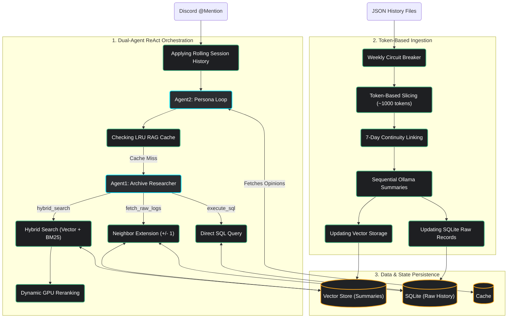

## Goal

This project's goal is to create a discord bot that can answer any questions about server history, interpreting history as absolute truth for entertainment purposes.

## Architecture

Diagram of the bot's architecture. Starting point is main.py:

## WHYS

We use sequential requests to Ollama in both summarization and user messages responses to avoid OOM errors.
We use FIFO queue for message processing in main.py to avoid lost update problem.
Agent2 is alias for persona ReAct agent that conducts conversation with user and uses tools to retrieve information from Agent1 and manage opinions.
Agent1 is alias for RAG agent that is responsible for using retrieved information from the database and writing report for Agent2.(Current)
We use qwen3:8b model for local inference with russian language proficiency.
I consider implementing qwen3.5:4b or qwen3.5:9b to boost speed and quality.

## Rules

Whenever you add any data storage, add it to gitignore.
When writing or modifying prompt templates in src/config/prompts.py, YOU MUST activate the prompt-engineering skill to write prompts with respect to model size.
Whenever you add any new functionality, make sure it is compliant with the SoC architecture.
You don't have permission to access logs/, messages_json/, llama_index_storage/ and cache/ folders as they may contain PII.
Include tests in every `implementation_plan.md`. For unplanned non-trivial logic changes, draft the implementation first and then ask: 'Would you like me to write a test for this?' Never implement tests without my explicit confirmation.

## Dev Log Protocol

To ensure continuous contextual alignment and maintain a precise technical record, you must curate a `DEV_LOG.md` after every significant task or session(append to the end of the file):

- **Content**: Each entry must contain datetime and exactly two sentences:
  - **Datetime**: (e.g. 07.04.2026 23:07)
  - **The What**: A technical summary of the changes.
  - **The Why**: The architectural or performance reasoning.
- **Constraint**: Keep entries brief and devoid of fluff.
