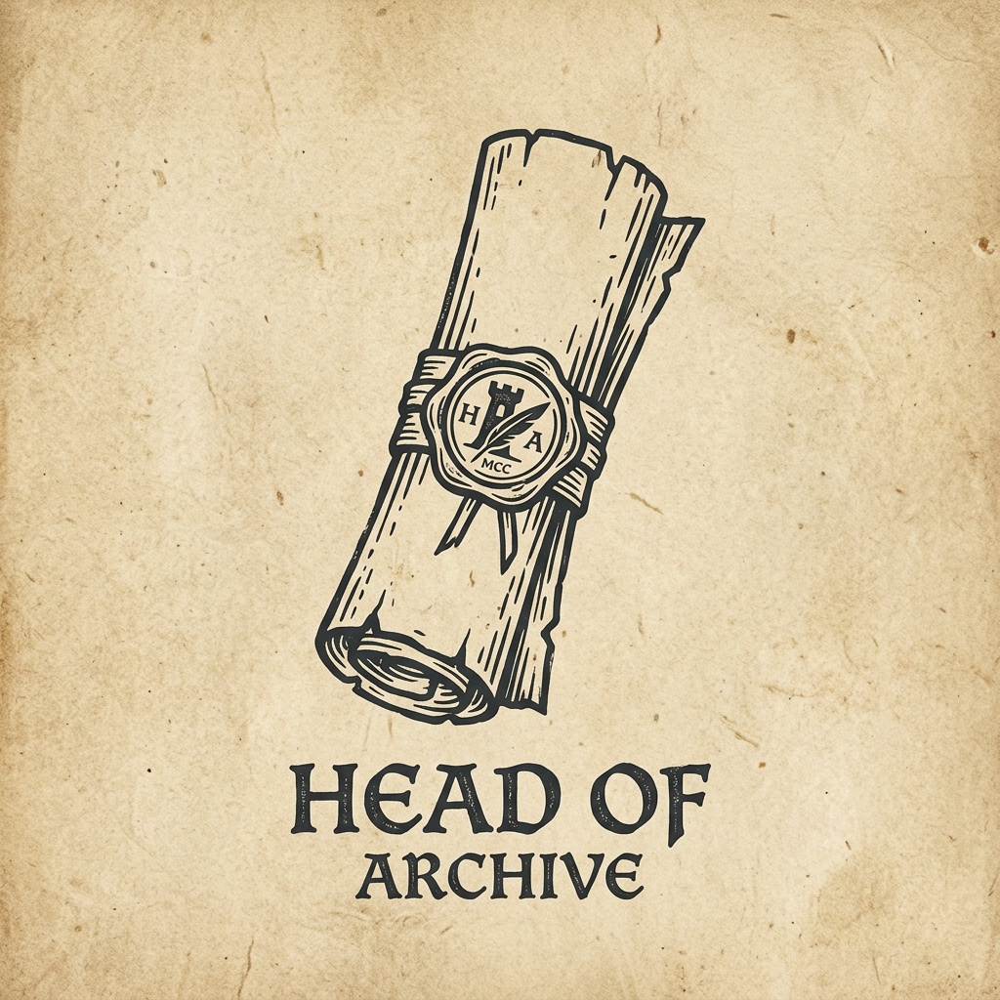
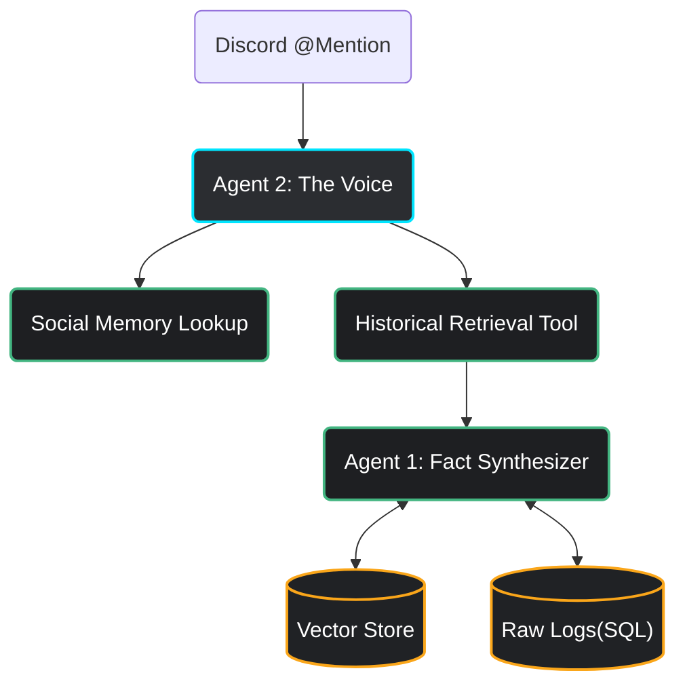

# Discord Assistant: Head of Archive 🤖🏛️

<p align="center">
  
</p>


[](https://discordpy.readthedocs.io/)
[](https://ollama.ai/)
[](https://www.python.org/)
[](https://opensource.org/licenses/MIT)

The **Head of Archive** (Глава Архива) is a high-performance Discord bot that transforms your server's chaotic history into an indisputable repository of absolute truth. Built for entertainment and deep contextual recall, it responds with the wisdom of a cynical historian who treats every log entry as an objective reality.

---

## ✨ Key Features

-   **Social Memory (Opinion System)**: The bot doesn't just read logs; it forms "opinions." It tracks user stances and past interactions to tailor its tone and recall your history with a personal touch.
-   **The Archive of Absolute Truth**: If it's in the logs, it happened. If it's not, it doesn't exist. The bot is optimized to resolve identities (UIDs/Roles) and retrieve granular details across years of history.
-   **Persona-Driven Interactions**: Deeply optimized for the **Russian language**, the bot maintains a consistent "Head of Archive" persona—wise, archaic, and unyielding in its facts.
-   **Live Archiving**: Admins can instantly "teach" the bot new history with the `!export` command, which is processed and indexed in real-time.
-   **Transparent Continuity**: Automatically expands retrieval to include neighboring messages, ensuring that context is never lost across chronological boundaries.

---

## 🛠️ How It Works (Under the Hood)

While the persona is the heart of the experience, the bot is powered by a robust **Agentic SoCe (Separation of Concerns)** architecture to ensure high-fidelity responses and hardware stability on local systems.



### 👥 The Digital Staff
*   **The Voice (Agent 2)**: A ReAct persona that manages the conversation, handles tools, and maintains the archive's tone.
*   **The Researcher (Agent 1)**: A dedicated retrieval expert that synthesizes raw logs and summaries into a factual report for the Voice.
*   **Automated Ingestion**: A background pipeline that groups history by **ISO-Weeks** and slices them into **Token-Aware Blocks**, ensuring memory safety and chronological integrity.

---

## 🚀 Getting Started

### 1. Prerequisites
- **Python 3.10+**
- **Ollama** installed and running.
- Pull the required models:
  ```bash
  ollama pull qwen3:8b
  ollama pull qwen3.5:4b
  ollama pull bge-m3
  ```

### 2. Installation
```bash
pip install -r requirements.txt
```

### 3. Configuration
Create a `.env` file in the root directory:
```env
TOKEN=your_bot_token_here
```

### 4. Usage
1.  **Start the Bot**: Ensure `ollama serve` is running, then execute `start.bat` or `python main.py`.
2.  **Archiving**: Admin users can use `/export` in any channel to crawl history.
3.  **Interaction**: Simply mention the bot: `@HeadOfArchive Who was the first person to join the server?`
