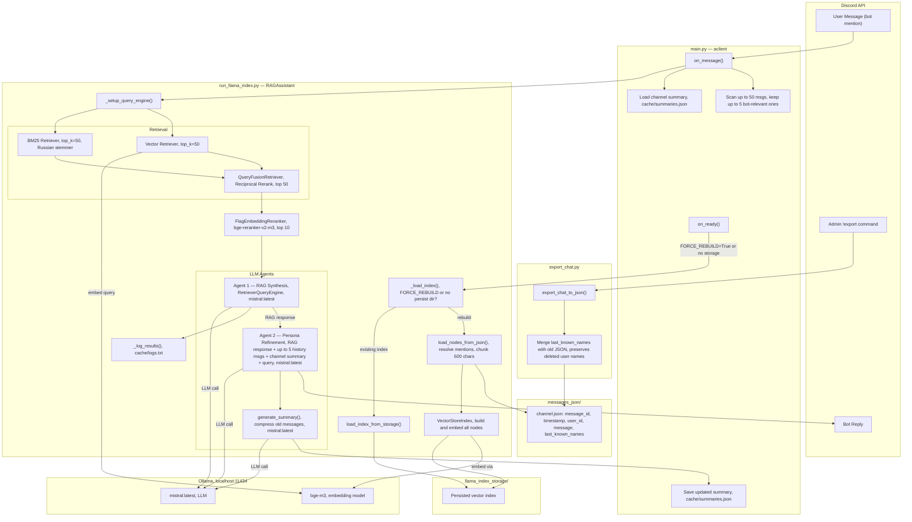
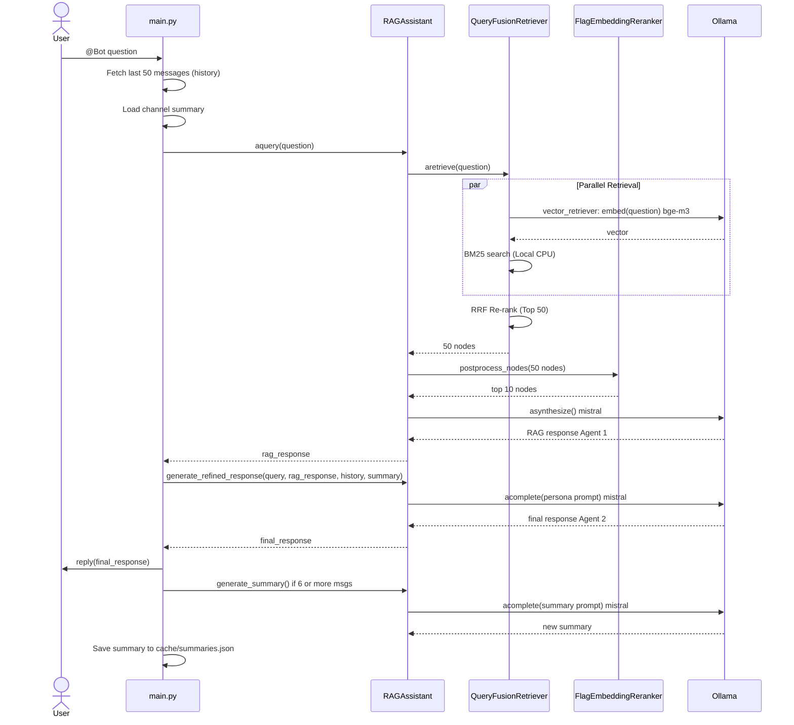
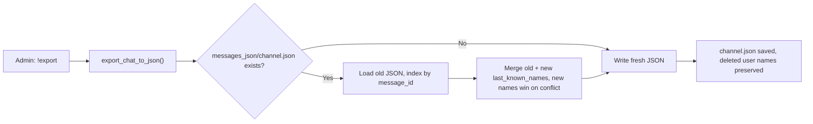
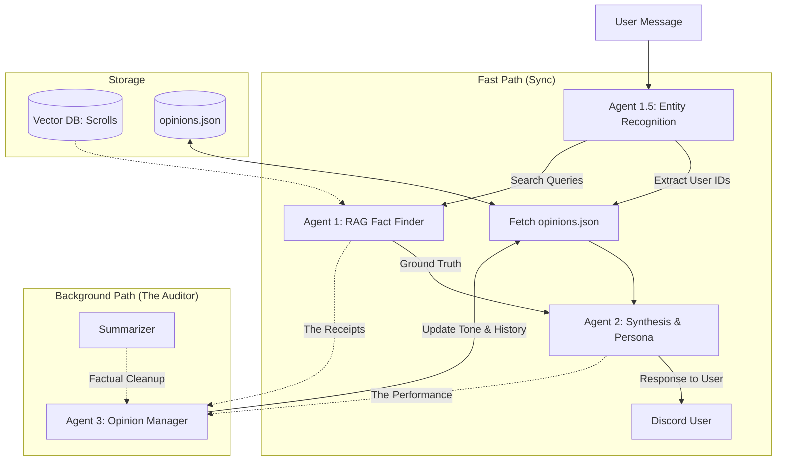

# Discord Assistant — Architecture

## System Overview

```mermaid
flowchart TD
    subgraph Discord["Discord API"]
        D_MSG["User Message (bot mention)"]
        D_EXPORT["Admin !export command"]
        D_REPLY["Bot Reply"]
    end

    subgraph Main["main.py — aclient"]
        ON_READY["on_ready()"]
        ON_MSG["on_message()"]
        HISTORY["Scan up to 50 msgs, keep up to 5 bot-relevant ones"]
        SUMMARY_LOAD["Load channel summary, cache/summaries.json"]
        SUMMARY_SAVE["Save updated summary, cache/summaries.json"]
    end

    subgraph Export["export_chat.py"]
        EXPORT_FN["export_chat_to_json()"]
        MERGE["Merge last_known_names with old JSON, preserves deleted user names"]
    end

    subgraph JSONStore["messages_json/"]
        JSON_FILES["channel.json: message_id, timestamp, user_id, message, last_known_names"]
    end

    subgraph RAG["run_llama_index.py — RAGAssistant"]
        LOAD_IDX["_load_index(), FORCE_REBUILD or no persist dir?"]
        INGEST["load_nodes_from_json(), resolve mentions, chunk 600 chars"]
        VEC_IDX["VectorStoreIndex, build and embed all nodes"]
        LOAD_EXISTING["load_index_from_storage()"]
        SETUP_QE["_setup_query_engine()"]

        subgraph Retrievers["Retrieval"]
            VEC_RET["Vector Retriever, top_k=50"]
            BM25["BM25 Retriever, top_k=50, Russian stemmer"]
            FUSION["QueryFusionRetriever, Reciprocal Rerank, top 50"]
        end

        RERANKER["FlagEmbeddingReranker, bge-reranker-v2-m3, top 10"]

        subgraph Agents["LLM Agents"]
            AGENT1["Agent 1 — RAG Synthesis, RetrieverQueryEngine, mistral:latest"]
            AGENT2["Agent 2 — Persona Refinement, RAG response + up to 5 history msgs + channel summary + query, mistral:latest"]
            SUMMARIZER["generate_summary(), compress old messages, mistral:latest"]
        end

        LOG["_log_results(), cache/logs.txt"]
    end

    subgraph Persist["llama_index_storage/"]
        SAVED_IDX["Persisted vector index"]
    end

    subgraph Ollama["Ollama, localhost:11434"]
        EMBED_MODEL["bge-m3, embedding model"]
        LLM_MODEL["mistral:latest, LLM"]
    end

    %% Startup flow
    ON_READY -->|"FORCE_REBUILD=True or no storage"| LOAD_IDX
    LOAD_IDX -->|rebuild| INGEST
    INGEST --> JSON_FILES
    INGEST --> VEC_IDX
    VEC_IDX -->|embed via| EMBED_MODEL
    VEC_IDX --> SAVED_IDX
    LOAD_IDX -->|existing index| LOAD_EXISTING
    LOAD_EXISTING --> SAVED_IDX

    %% Query flow
    D_MSG --> ON_MSG
    ON_MSG --> HISTORY
    ON_MSG --> SUMMARY_LOAD
    ON_MSG --> SETUP_QE
    SETUP_QE --> VEC_RET
    SETUP_QE --> BM25
    VEC_RET --> FUSION
    BM25 --> FUSION
    FUSION --> RERANKER
    RERANKER --> AGENT1
    AGENT1 -->|RAG response| AGENT2
    AGENT2 --> D_REPLY
    AGENT2 --> SUMMARIZER
    SUMMARIZER --> SUMMARY_SAVE
    AGENT1 --> LOG

    %% LLM usage
    AGENT1 -->|LLM call| LLM_MODEL
    AGENT2 -->|LLM call| LLM_MODEL
    SUMMARIZER -->|LLM call| LLM_MODEL
    VEC_RET -->|embed query| EMBED_MODEL

    %% Export flow
    D_EXPORT --> EXPORT_FN
    EXPORT_FN --> MERGE
    MERGE --> JSON_FILES
```

## Data Flow: Query Pipeline

```mermaid
sequenceDiagram
    actor User
    participant Bot as main.py
    participant RAG as RAGAssistant
    participant Fusion as QueryFusionRetriever
    participant Reranker as FlagEmbeddingReranker
    participant Ollama

    User->>Bot: @Bot question
    Bot->>Bot: Fetch last 50 messages (history)
    Bot->>Bot: Load channel summary
    Bot->>RAG: aquery(question)
    RAG->>Fusion: aretrieve(question)
    par Parallel Retrieval
        Fusion->>Ollama: vector_retriever: embed(question) bge-m3
        Ollama-->>Fusion: vector
        Fusion->>Fusion: BM25 search (Local CPU)
    end
    Fusion->>Fusion: RRF Re-rank (Top 50)
    Fusion-->>RAG: 50 nodes
    RAG->>Reranker: postprocess_nodes(50 nodes)
    Reranker-->>RAG: top 10 nodes
    RAG->>Ollama: asynthesize() mistral
    Ollama-->>RAG: RAG response Agent 1
    RAG-->>Bot: rag_response
    Bot->>RAG: generate_refined_response(query, rag_response, history, summary)
    RAG->>Ollama: acomplete(persona prompt) mistral
    Ollama-->>RAG: final response Agent 2
    RAG-->>Bot: final_response
    Bot->>User: reply(final_response)
    Bot->>RAG: generate_summary() if 6 or more msgs
    RAG->>Ollama: acomplete(summary prompt) mistral
    Ollama-->>RAG: new summary
    Bot->>Bot: Save summary to cache/summaries.json
```

## Export & Re-Export Flow

```mermaid
flowchart LR
    A["Admin: !export"] --> B["export_chat_to_json()"]
    B --> C{"messages_json/channel.json exists?"}
    C -->|No| E["Write fresh JSON"]
    C -->|Yes| D["Load old JSON, index by message_id"]
    D --> F["Merge old + new last_known_names, new names win on conflict"]
    F --> E
    E --> G["channel.json saved, deleted user names preserved"]
```

## Opinion system

```mermaid
graph TD
    %% Entry Point
    U[User Message] --> A15[Agent 1.5: Entity Recognition]
    
    %% Synchronous Path (Immediate Response)
    subgraph "Fast Path (Sync)"
        A15 -->|Extract User IDs| DB_OP[Fetch opinions.json]
        A15 -->|Search Queries| A1[Agent 1: RAG Fact Finder]
        DB_OP --> A2[Agent 2: Synthesis & Persona]
        A1 -->|Ground Truth| A2
        A2 -->|Response to User| DIS[Discord User]
    end

    %% Asynchronous Path (Background Processing)
    subgraph "Background Path (The Auditor)"
        A2 -.->|The Performance| A3[Agent 3: Opinion Manager]
        A1 -.->|The Receipts| A3
        SUM[Summarizer] -.->|Factual Cleanup| A3
        A3 -->|Update Tone & History| DB_OP
    end

    %% Data Sources
    subgraph "Storage"
        KB[(Vector DB: Scrolls)] -.-> A1
        JSON[("opinions.json")] <--> DB_OP
    end
```