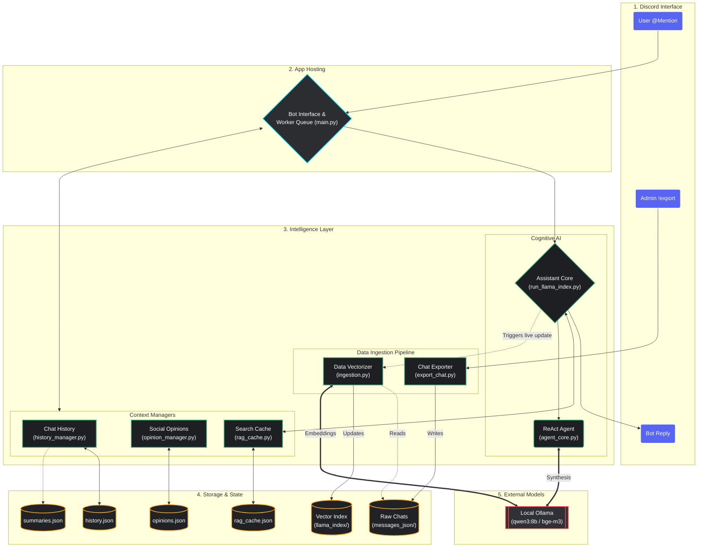
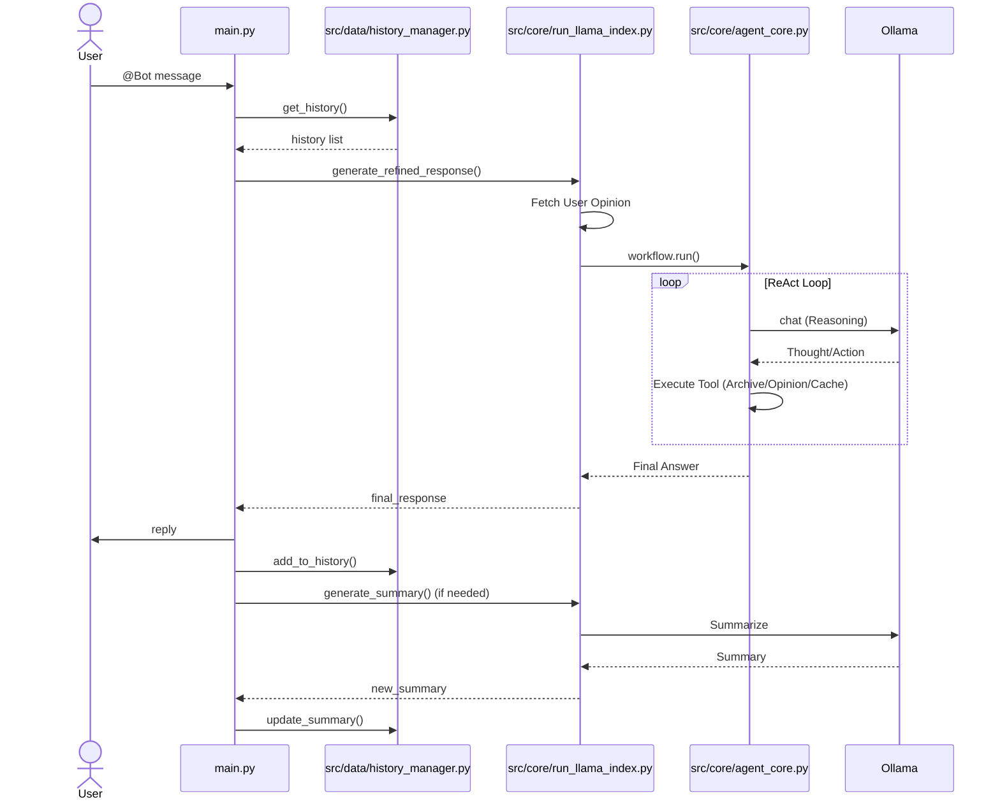

# Discord Assistant — Architecture

## 1. Unified System Overview & Data Flow

This chart represents the modular architecture, encompassing configuration, data ingestion, retrieval logic, and the messaging pipeline.

## 2. Component Responsibilities

- **main.py (Bot Interface)**: Entry point and Discord client. Manages an **asynchronous worker queue** to process user messages sequentially, ensuring LLM stability and protecting local hardware from memory spikes.
- **src/config/config.py**: Centralized configuration, LlamaIndex settings, and file paths.
- **src/config/prompts.py**: Long prompt strings, system templates, and persona definitions.
- **src/data/ingestion.py**: Data cleaning, mention resolution, and LlamaIndex vector store management.
- **src/data/history_manager.py**: Logic for loading, saving, and truncating channel-specific history and summaries.
- **src/core/agent_core.py**: The custom ReAct agent workflow implementation.
- **src/core/run_llama_index.py (Assistant Core)**: The "brain" of the bot. Orchestrates RAG (Agent 1) and Refined Response (Agent 2) synthesis using a ReAct workflow.
- **src/core/rag_cache.py**: Implements the LRU cache (RAGCache) to store and retrieve recent search results, improving efficiency for follow-up questions.
- **src/data/opinion_manager.py**: Manages long-term user profiles and stances.

## 3. Sequence Diagram (Messaging)

