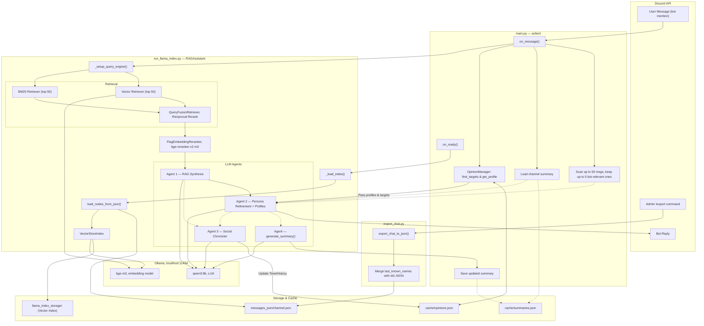
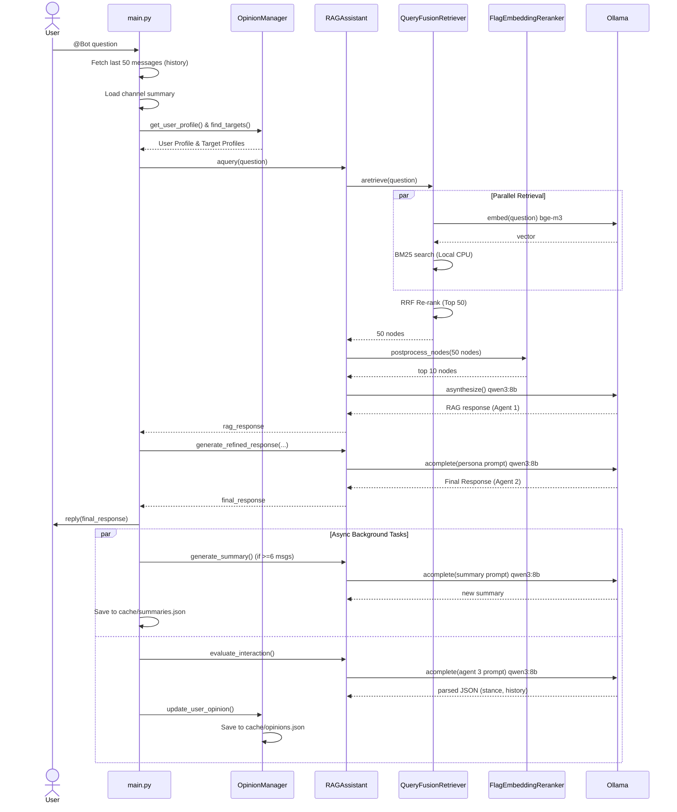

# Discord Assistant — Architecture

## 1. Unified System Overview & Data Flow

This chart represents the high-level architecture, encompassing data ingestion, retrieval logic, the primary messaging pipeline, and the background Agent 3 (Social Auditor).

## 2. Detailed Query Sequence

A closer look at the step-by-step query execution, including the parallel processing and agent pipeline.

